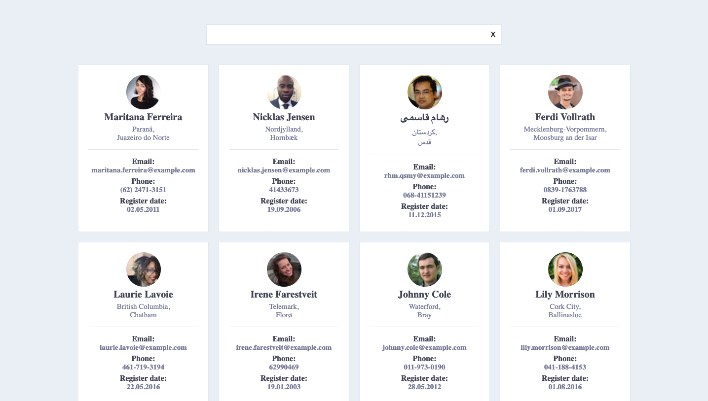

## Filter by table with random users

### Technologies:

`CSS` `HTML` `JavaScript`

### How to launch a project:

1. Clone this project.
2. Install the necessary packages with the command: **`npm install`**
3. Start the server with the command: **`npm start`**

#### [>Try the app<](https://lacuba.github.io/users-table/)

---

### Как запустить проект:

1. Клонировать этот проект.
2. Установить нужные пакеты командой: **`npm install`**
3. Запустить сервер командой: **`npm start`**

#### [>Попробуй приложение<](https://lacuba.github.io/users-table/)
